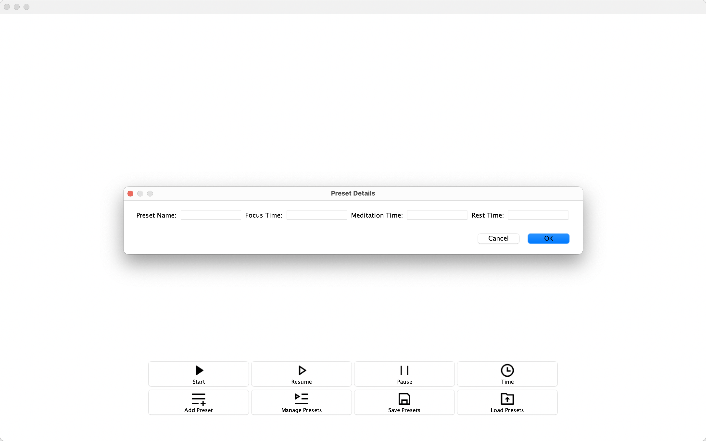

### Focus Clinic helps you reach and maintain peak efficiency while completing a task.
###
#### Here's how it works:
1. A variation of Brownian noise at a low frequency is played for 50 minutes to focus.
2. A second variation of Brownian noise at a moderate frequency is played for 10 minutes to meditate.
3. Repeat steps 1-2.
4. A third variation of Brownian noise at a high frequency is played for 30 minutes to rest.
5. Repeat steps 1-5.

Users can also set custom time limits and save them as presets.

### How to use Focus Clinic
As a user, you can:

- Start, pause, or resume the application.
- View the remaining time for your current block in the time window.
- View time spent on each block in the time window.
- Create your own preset with custom time limits, and add it to your preset list.
- Manage your presets by selecting or deleting them.
- Save and load your preset list.

#### Screenshots Below





###
#### Intent
This process effectively helps block out distracting noises by playing three variations of
curated Brownian noises at set intervals. If it's time to take a break, the shift in sound frequency will
subtly notify you to focus, meditate, or rest. However, if you're already in a state of deep focus, no
loud alarms will be there to distract you.

This is a shift from common time management strategies such as:

- Pomodoro Technique
- Flow State
- Ultradian Performance Rhythms
- 52/17 Rule

Focus Clinic seeks to address common criticisms from these techniques and further improve upon
them.

##### Here are some examples:
1. The Pomodoro Technique is not accommodating to longer tasks.
   1. If you're someone who needs to work on a task that requires long thought such as solving
a complex math problem, 25 minutes may not be sufficient. Right when you're starting to think of a
solution, an alarm starts ringing at you, and the constant discontinuity created from these alarms
can be a detriment to getting into a state of deep focus for extended periods.
#####
2. Flow state doesn't give you a structured approach to taking any breaks, so not taking any breaks
will eventually result in you no longer becoming efficient while completing a task.
   1. Focus Clinic allows you to choose if you'd like to continue your work or take a break in a
non-intrusive manner: If you need a break, you'll most likely notice the change in sound frequency
when your focus block has ended. However, if you're in a flow state, you may not notice the subtle
change in sound frequency, allowing you to continue your work undisturbed.
#####
3. Ultradian Performance Rhythms and the 52/17 Rule are challenging to keep track of in terms of time.
   1. Focus Clinic has the simplest time structure out of the mentioned strategies, so it's easy to keep
track of how much time is remaining or how long you've spent either focusing, meditating, or
resting.

    Additionally, Focus Clinic automatically keeps track of how much time you've spent on
each block, and also shows you how much time is remaining before you move on to the next block,
allowing you to effortlessly keep track of your progress.
#####
4. Focus Clinic is flexible, purposeful, and non-intrusive.
   1. If you'd like to set a custom time limit, you can easily do so by adding and saving as many
presets as you want for each block.
   2. Focus Clinic has meditation blocks after each focus block, encouraging you to rest mindfully
as opposed to something like mindless Internet browsing.
   3. Since the process uses a subtle change in sound frequency to notify users when to take breaks,
reminders no longer have the possibility of being distracting.

## Notes
### Event Logging
- The application logs each time a preset is added or deleted from the preset list, and prints
them to the console when the application is exited.

Below is a sample of what is printed to the console when the application is run and immediately exited.
```
Wed Aug 24 01:01:01 PDT 2022
Added Preset: Default.
```

### Refactoring Changes

- Reflecting on the UML class diagram and the code structure of the application, if I had more time
  to work on the project I'd likely make a fair amount of refactoring changes.

These changes would include:

#### 1. Improving coupling by abstracting duplicated code into methods, such as any time I add buttons in my FocusClinicApp class:
#### (Update: Completed)
- Note that in the following methods, the only difference is the JButton description and ImageIcon path,
  as well as the local variable names and the parameter passed into setActionCommand(String text).

```
    // REQUIRES: START_ICON_PATH to be a valid relative path
    // MODIFIES: this
    // EFFECTS: adds a start button to homeButtonArea
    private void addStartButton() {
        JButton startButton = new JButton("Start", new ImageIcon(START_ICON_PATH));
        startButton.setIconTextGap(0);
        startButton.setVerticalTextPosition(SwingConstants.BOTTOM);
        startButton.setHorizontalTextPosition(SwingConstants.CENTER);
        startButton.setActionCommand("start");
        startButton.addActionListener(this);
        homeButtonArea.add(startButton);
    }

    // REQUIRES: RESUME_ICON_PATH to be a valid relative path
    // MODIFIES: this
    // EFFECTS: adds a resume button to homeButtonArea
    private void addResumeButton() {
        JButton playButton = new JButton("Resume", new ImageIcon(RESUME_ICON_PATH));
        playButton.setIconTextGap(0);
        playButton.setVerticalTextPosition(SwingConstants.BOTTOM);
        playButton.setHorizontalTextPosition(SwingConstants.CENTER);
        playButton.setActionCommand("resume");
        playButton.addActionListener(this);
        homeButtonArea.add(playButton);
    }
```

#### 2. Improving the single responsibility principle by splitting up a class, such as in the FocusClinicApp class:
- To assess the cohesion of my application, in each class I can imagine an informal usage graph
  that shows which methods use which fields. From this, I can see that the number of fields and methods
  which exist in my FocusClinicApp class would have several distinct clusters, notably methods related to initializing and playing sounds,
  creating the GUI where there are several methods related to making buttons or popup windows, as well as methods related to displaying
  time details. This could result in at least three different classes, such as a class specifically for the creation of the GUI, another class for
  sounds, and another class for time details. This would improve cohesion/SRP and make code more readable and manageable.

#### 3. Split up certain methods by introducing helper methods to improve readability, such as the savePreset() and loadPresets() methods in the FocusClinicApp class:
#### (Update: Completed)
- Note that in the following methods, we can see that when savePresets() or loadPresets() is called,
  we're essentially performing two different actions; one where we save/load the presets, and one where we create a confirmation popup window
  to notify the user that the action was performed. Although I separated these lines to make it more understandable what's going on, it would be better to
  introduce a helper method after saving/loading the presets, such as showConfirmationWindow().

```
    // MODIFIES: this
    // EFFECTS: saves the current session to file and opens a popup window confirming action
    private void savePresets() {
        try {
            jsonWriter.open();
            jsonWriter.write(presets);
            jsonWriter.close();

            JFrame savePresetsConfirmationWindow = new JFrame();
            JTextArea presetsSavedText = new JTextArea("Your presets have been saved.");
            savePresetsConfirmationWindow.setLayout(new GridBagLayout());
            savePresetsConfirmationWindow.setMinimumSize(new Dimension(300, 100));
            savePresetsConfirmationWindow.setLocationRelativeTo(null);
            savePresetsConfirmationWindow.setVisible(true);
            presetsSavedText.setEnabled(false);
            presetsSavedText.setBorder(new EmptyBorder(40, 55, 40, 61));
            savePresetsConfirmationWindow.add(presetsSavedText);
            savePresetsConfirmationWindow.pack();
        } catch (FileNotFoundException e) {
            System.out.println("Unable to write to file: " + JSON_STORE);
        }
    }

    // MODIFIES: this
    // EFFECTS: loads presets from file and opens a popup window confirming action
    private void loadPresets() {
        try {
            presets = jsonReader.read();

            JFrame loadedPresetsConfirmationWindow = new JFrame();
            JTextArea presetsLoadedText = new JTextArea("Your presets have been loaded.");
            loadedPresetsConfirmationWindow.setLayout(new GridBagLayout());
            loadedPresetsConfirmationWindow.setMinimumSize(new Dimension(300, 100));
            loadedPresetsConfirmationWindow.setLocationRelativeTo(null);
            loadedPresetsConfirmationWindow.setVisible(true);
            presetsLoadedText.setEnabled(false);
            presetsLoadedText.setBorder(new EmptyBorder(40, 55, 40, 55));
            loadedPresetsConfirmationWindow.add(presetsLoadedText);
            loadedPresetsConfirmationWindow.pack();
        } catch (IOException e) {
            System.out.println("Unable to read from file: " + JSON_STORE);
        }
    }
```

- You can alternatively add a preset by using the keyboard shortcut Control + A.